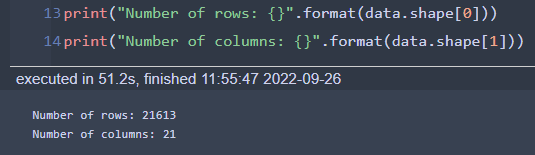
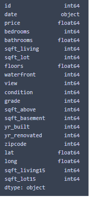
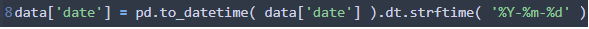
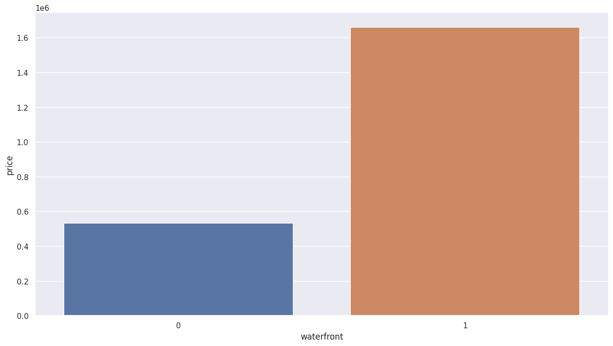
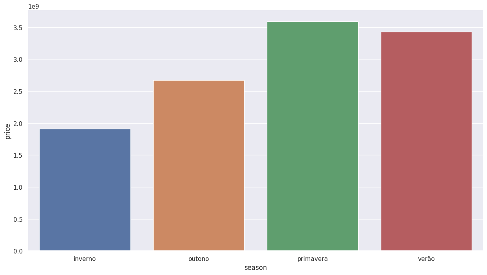
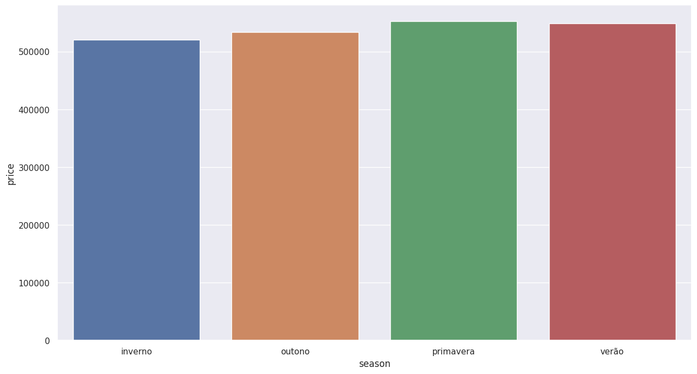
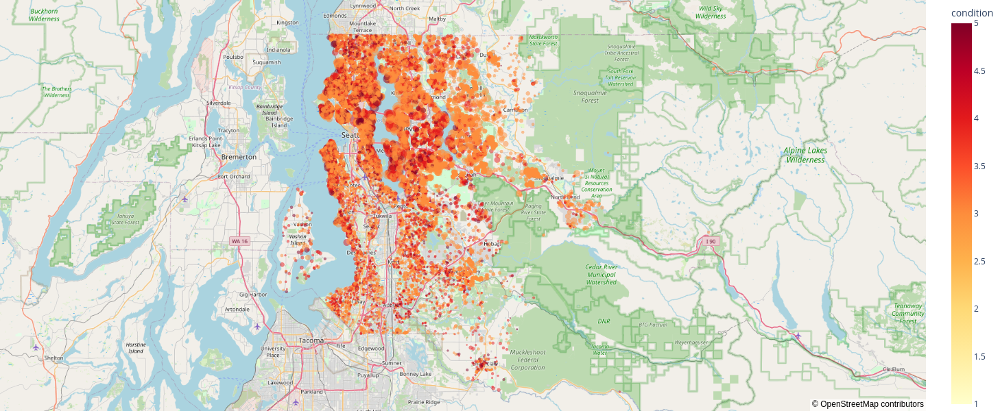
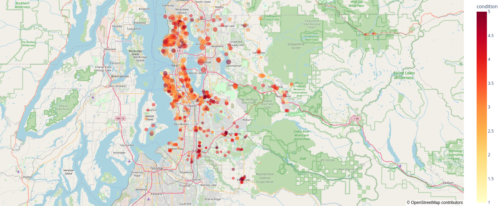

# HOUSE ROCKET COMPANY - PROJETO DE INSIGHTS

  
  
  

# 1.0. DESCRIÇÃO

___

House Rocket Company é uma empresa que trabalha com compra e venda de imóveis, com especialização no setor de análise e consultoria de dados para realização de transações financeiras no setor de acordo com margens de lucro previstas mediante insights quando do estudo das características dos imóveis feitos em dada região.

__*Este é um projeto fictício. A empresa, o contexto e as perguntas de negócios não são reais.__

# 2.0. PROBLEMA DE NEGÓCIO

____

O time de negócios irá trabalhar seguindo a estratégia de comprar boas casas em ótimas localizações com preços baixos e revendê-las posteriormente à preços mais altos. Quanto maior a diferença entre compra e venda, maior o lucro/receita gerado para a empresa

De forma a direcionar as análises, o time de negócios deve responder a 3 perguntas base que servirão de parâmetro para a análise dos dados:

- Quais casas o CEO da House Rocket deveria comprar e por qual preço de compra?

- Uma vez a casa em posse da empresa, qual  melhor momento para vendê-las e qual seria o preço de venda?

- A House Rocket deveria fazer uma reforma para aumentar o preço de venda? Quais seriam as sugestões de mudança? Qual o incremento no preço dado por cada opção de reforma?

# 3.0. DESCRIÇÃO DE DADOS

___

## 3.1. Data Dimensions

O conjunto de dados que representam o contexto está disponível na plataforma Kaggle pelo link: [House Sales Prediction](!https://www.kaggle.com/harlfoxem/housesalesprediction)

Esse conjunto de dados contém casas vendidas entre Maio de 2014 e Maio de 2015. Serão estes os dados usados para o desenvolvimento das hipóteses de projeto.

  
  

## 3.2 Descrição dos Atributos

| Atributos  | Significado|
| ------------- | ------------- |
| id   | Numeração única de identificação de cada imóvel  |
| date  | Data de venda da casa  |
| price  | Preço que a casa está sendo vendida para o proprietário  |
| bedrooms  | Número de quartos  |
| bathrooms  | Número de banheiros (0.5 = banheiros em um quarto, mas sem chuveiro)  |
| sqft_living  | Medida (em pés quadrados) do espaço interior dos apartamentos  |
| sqft_lot  | Medida (em pés quadrados) do espaço terreste |
| floors  | Número de andares do imóvel  |
| waterfront  | Variável que indica a presença ou não de vista para água (0 = não, 1 = sim)  |
| view  | Um índice que indica de 0 a 4 a qualidade da vista da propriedade. Varia de 0 a 4, onde: 0 = baixa, 4 = alta  |
| condition | Um índice de 1 a 5 que indica a condição (integridade) da casa, onde 1 = Muito Ruim e 5 = Muito boa |
| grade  | Um índice de 1 a 13 que índica a complexidade de construção e design do edifício, onde 1~3 = Baixo; 7 = Médio ; 11~13 = Alta  |
| sqft_basement  | A metragem quadrada do espaço habitacional interior acima do nível do solo  |
| yr_built  | Ano de Construção de cada imóvel  |
| yr_renovated  | Ano de Reforma de cada imóvel |
| zipcode  | CEP da casa  |
| lat  | Coordenada geográfica de Latitude do imóvel  |
| long  | Coordenada geográfica de Longitude do imóvel  |
| sqft_living15  | Medida (em pés quadrados) do espaço interno da habitação para os 15 vizinhos maix próximos |
| sqft_lot15 | medida (em pés quadrados) dos lotes de terra dos 15 vizinhos mais próximos  |

## 3.2.1 Tipos de Dados

  
  

Os dados do dataframe original compreendem majoritariamente 2 tipos númericos: int64 e float64. Nota-se que os dados nominais (Ex: Colunas 'Waterfront', 'view', 'condition' e 'grade') já estão contabilizadas após um processo de encoding, encaixando-se portanto dentro de uma das categorias numéricas citadas (int64). 

## 3.3. Alterações nos tipos de dados

A única exceção observada em relação aos tipos de dados do dataframe original é a coluna 'date', referente a data de registro do imóvel a venda. Originalmente, os dados contam como tipo 'object', necessitando portanto de alteração para o formato de data de acordo com o formato 'ano-mês-dia', conforme explicitado na figura a seguir:

  
  

Tal formato para data foi adotado uma vez que os dados contidos nessa coluna compreendem o período entre Maio de 2014 e Maio de 2015, fazendo-se necessária a análise através da diferenciação das instâncias pelos seus respectivos meses e dias. Tal alteração não foi necessária para os tipos de dados contidos nas colunas 'yr_built' e 'yr_renovated' (Ano de construção e Ano de renovação, respectivamente), uma vez que basta a diferenciação pelo valor do ano indicado, o qual a formatação em tipo 'int64' satisfaz os requisitos necessários para análise.

# 4.0. PREMISSAS DE NEGÓCIO

___

As seguintes premissas foram consideradas para o projeto:

  - Os valores iguais a zero em yr_renovated são casas que nunca foram reformadas.
  - O valor igual a 33 na coluna bathroom foi considerada um erro e por isso foi delatada das análises
  - A coluna price significa o preço que a casa foi / será comprada pela empresa House Rocket
  - Valores duplicados em ID foram removidos e considerados somente a compra mais recente
  - A localidade e a condição do imóvel foram características decisivas na compra ou não do imóvel
  - A estação do ano foi a característica decisiva para a época da venda do imóvel

# 5.0. ESTRATÉGIA DE SOLUÇÃO

____

As etapas para solucionar o problema de negócio seguem:

  1. Coleta de dados via Kaggle
  2. Entendimento de negócio
  3. Tratamento de dados (Transformação de Variáveis e Limpeza de Dados)
  4. Exploração de dados
  5. Responder problemas do negócio
  6. Resultados para o negócio
  7. Conclusão

 # 6.0. TRADUÇÃO PARA NEGÓCIO
 
 ___
 
| Hipótese  | Resultado | Tradução para Negócio |
| ------------- | ------------- | ------------- |
| H1 - Imóveis com vista para a água são em média 30% mais caros | Verdadeiro | Investir em Imóveis sem vista para água  |
| H2 - Imóveis com data de construção menor que 1955, são 50% mais baratos, na média  | Falso | O investimento em imóveis não depende de sua data de construção |
| H3 - Imóveis com porão são em média 20% mais caros que imóveis sem porão. | Verdadeiro | Investir em imóveis sem porão |
| H4 - O crescimento do preço dos imóveis mês após mês no ano de 2014 é de 10% | Falso | Investir em imóveis durante o período dos meses de Setembro (Mês 09) e Março (Mês 03)|
| H5 - Imóveis com boa avaliação arquitetônica ( 'grade' >=  7) são em média 50% mais caros que os demais | Verdadeiro  | Investir em imóveis com média-baixa avaliação |
| H6 - Imóveis Renovados são em média 30% mais caros  | Verdadeiro | Investir em imóveis antigos e não renovados para reformá-los para venda  |
| H7 - Imóveis com mais banheiros são em média 5% mais caros | Falso | Não há uma relação linear entre as váriaveis de preço do imóvel e número de banheiros |
| H8 - Imóveis são vendidos com maior frequência na primavera, totalizando aumento de até 50% no montante do valor de preços vendidos | Verdadeiro  | Investir em imóveis durante os meses 09 a 03 para compra, e dos meses 04 a 07 para venda.  |
| H9 - Imóveis são vendidos, em média,  a preços 50% maiores durante a estação de mais alta procura (verão) em comparação ao período de menor procura (inverno)  | Falso  | O valor do preço médio dos imóveis não é afetado no decorrer das estações.  |
| H10 - Imóveis diferem de até 70% no valor de preço de venda entre a região mais cara e a sua região vizinha  | Verdadeiro | Priorizar investimento em regiões mais afastadas da região comercial de Seattle (Lake Washington). |

## 6.1. Top Insights Obtidos

Seguem os insights mais relevantes para o projeto:

* H1. Imóveis com Vista para água são mais caros.
    _Verdadeiro_: A vista para água eleva o preço do imóvel, sendo o parâmetro com maior correlação de influência com o preço de venda.

  
  

* H3. Imóveis com porão são mais caros.
    _Verdadeiro_: O preço médio dos imóveis são consideravelmente maiores quando o imóvel possui porão.

  
  

* H5. Imóveis com boa avaliação arquitetônica ('grade' >= 7) são em média 50% mais caros que os demais.
    _Verdadeiro_: A Avaliação influencia drasticamente no preço do imóvel, tornando mais rentável o investimento em imóveis com avaliação entre 0 e 6.

  
  

* H6. Imóveis renovados são até 35% mais caros
    _Verdadeiro_: A renovação de imóveis influencia no preço médio dos imóveis. Notar que a data de renovação exerce pouca influência no valor do preço.

  
  

* H8 e H9. Crescimento do preço mês após mês em 2014 é de 10%.
    _Falso_: Observa-se um decaimento no somatório do valor arrecadado em vendas (registros) da primavera ao inverno. A média de preços dos imóveis se mantém estável ao longo das estações do ano.
    

  
  

  
  

## 6.2 Resultados Finais

O resultado da seleção final para imóveis que atendem aos insights obtidos pela validação de hipóteses, fez-se a filtragem do dataset original **(21613 imóveis)** para as características:
* Sem vista para água;
* Sem porão;
* Avaliação entre 0 e 6;
* Imóveis não renovados;
* Compra de Imóveis entre os meses de Outubro/2014 a Maio/2015

Com isso, obtemos um dataset resultante de **832 imóveis** recomendados para compra. O mapa comparativo da localização desses imóveis presentes na base de dados segue:

  
  

  
  

Dos imóveis recomendados para compra (837 entradas), obteve-se um valor médio de preço de imóvel de **U$246.000,00**. Considerando uma estimativa simples de 30% de lucro na revenda de imóveis com preço de venda abaixo desse valor médio, e lucro de 10% sobre imóveis com valor acima ao preço médio, totalizou-se uma estimativa de **U$38.092.369,00** de rentabilidade final sobre todos os ióveis analisados.

## 6.3 Visualição da Aplicação em Produção (Model Deploy)

De forma a permitir que os resultados testados sejam escaláveis para aplicação ao problema de negócio, optou-se por disponibilizar a visualização da aplicação através de um aplicativo web construído através da biblioteca python [Streamlit](!https://docs.streamlit.io/).
A capacidade de modularização da aplicação criada permite que o solicitante do problema de negócio possa customizar a exploração banco de dados através da aplicação de filtros em tempo real, possibilitando a visualização rápida de insights que podem ser aplicados em ciclos posteriores de desenvolvimento para geração de valor à empresa, bem como servir de ferramenta visual para a validação das hipóteses formuladas a partir dos insights já criados.
Para abranger a maior parte das características das casas registradas no banco de dados, foram disponibilizados os seguintes filtros interativos:

- Filtragem dos imóveis por um ou mais códigos postais (Visualização em Tabela)
- Filtragem de um ou mais atributos (colunas) dos imóveis (Visualização em Tabela)
- Filtragem de métricas dos valores médios referentes ao preço, tamanho da sala de estar, preço/m² para a totalidade de imóveis em cada região de código postal (Visualização em Tabela)
- Análise de métricas descritivas dos atributos numéricos (quantitativos) dos imóveis (Visualição em tabela dos valores referentes aos valores máximo, mínimo, média, mediana e Desvio Padrão de cada atributo)
- Mapas com plotagem dos imóveis, mostrando a densidade da quantidade de imóveis por região e também a densidade de preço de venda por região (Visualização em Mapa)
- Checagem da variação anual de preço de imóvel, de acordo com o ano de construção de cada imóvel. (Visualização através de gráfico com a curva de preço de vendas ao longo do tempo de construção do imóvel)
- Checagem da variação diária do preço de venda. (Visualização através de gráfico com a curva do preço de venda ao longo das datas de postagem do anúncio ao longo dos dias entre os imóveis registrados - compreendem o período entre Maio de 2014 e Maio de 2015)
- Verificação da distribuição quantitativa de imóveis agrupados por faixa de preço, número de quartos, número de banheiros, número de andares, e vista para água (Visualização em gráfico de Barras, destacando as proporções das contagens)

A aplicação fica hospedada no link a seguir, com funcionamento 24/7, garantindo agilidade ao time de negócios.

  
  |         **Click no botão abaixo para visualizar o site**        |
  |:------------------------:|
  |          |
  

# 7.0 Conclusões

___

Conforme verificado, o projeto atendeu a demanda inicial: a de indicar imóveis do banco de dados com boa possibilidade de lucro em sua revenda.
Também vale destacar que a solução criada também permite que o time de negócio possa estabelecer as métricas de análise desejadas com alto grau de customização com a aplicação criada via Streamlit, proporcionando mais agilidade ao processo de tomada de decisões.

# 8.0 Lições Aprendidas

___

- Priorizar a entrega de valor para agilização do processo de tomada de decisão por parte do time de negócios
- Construção de uma aplicação em web para visualização, garantindo a sua estabilidade, facilidade de uso e entendimento

# 9.0 Próximos Passos

___

- Com as Hipóteses validadas, investigar através de seu feedback a correlação dos atributos dos imóveis com o preço de venda.
- Implementar novas hipóteses conforme insights e conhecimentos do time de negócios.

# 10.0 Ferramentas e Técnicas Usadas

___

- [Python 3.9.15](!https://www.python.org/downloads/release/python-380/), [Pandas](!https://pandas.pydata.org/), [Numpy](!https://numpy.org/) , [Matplotlib](!https://matplotlib.org/), [Geopandas](!https://geopandas.org/en/stable/) e [Seaborn](!https://seaborn.pydata.org/)
- [Jupyter Notebook](!https://jupyter.org/) e [VS Code](!https://code.visualstudio.com/)
- [Streamlit Cloud](!https://docs.streamlit.io/)
- [Git](!https://git-scm.com/) e [GitHub](!https://github.com/)
- [Análise Exploratória de Dados](!https://www.ibm.com/br-pt/cloud/learn/exploratory-data-analysis)

# 11.0 Contatos

___

-  ou 
- 
- 

